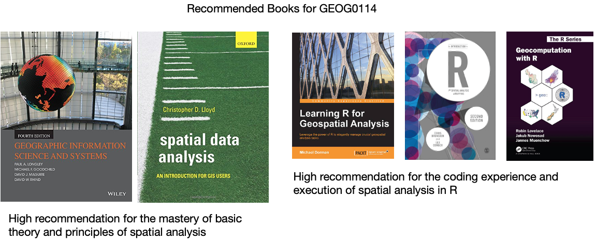

# Reading List for GEOG0114 {-}

```{r echo=FALSE, out.width = "100%", fig.align='center', cache=TRUE,}

```

Contact me via email (**a.musah@ucl.ac.uk**) if you are having problems securing one or any of these recommended books from the UCL library or elsewhere. 

## Week 1: Spatial analysis for data science {-}

1. **Book**: [Theory] Longley, P. _et al_ (2015) Geographic Information Science & Systems (4th Edition); **Chapters 2: The Nature of Geographic Data** [**Click link**](https://rl.talis.com/3/ucl/items/61CF5A5F-A6A3-9506-1F94-DF3CBD81CC3A.html) (Note: use of your UCL login via institutional organisation (**UK Federation**) is required to access the digital book)
2. **Book**: [Theory] Longley, P. _et al_ (2015) Geographic Information Science & Systems (4th Edition); **Chapters 3: Representing Geography** [**Click link**](https://rl.talis.com/3/ucl/items/61CF5A5F-A6A3-9506-1F94-DF3CBD81CC3A.html) (Note: use of your UCL login via institutional organisation (**UK Federation**) is required to access the digital book)
3. **Book**: [R Programming] Brunsdon, C. _et al_ (2018) An Introduction to R for Spatial Analysis and Mapping; **Chapter 3: Basics of Handling Spatial Data in R** [**Click link**](https://ucl.primo.exlibrisgroup.com/discovery/search?query=any,contains,An%20Introduction%20to%20R%20for%20Spatial%20Analysis%20and%20Mapping&tab=Everything&search_scope=MyInst_and_CI&sortby=date_d&vid=44UCL_INST:UCL_VU2&facet=frbrgroupid,include,9076326046905167101&offset=0) (Note: Books can be borrowed from UCL's Library)
4. **Book**: [R Programming] Dorman, M. (2014) Learning R for Geospatial Analysis; **Chapter 1: The R Environment** [**Click link**](https://learning.oreilly.com/library/view/learning-r-for/9781783984367/ch01.html) (Note: Digital book)
5. **Book**: [R Programming] Dorman, M. (2014) Learning R for Geospatial Analysis; **Chapter 3: Working with tables** [**Click link**](https://learning.oreilly.com/library/view/learning-r-for/9781783984367/ch03.html) (Note: Digital book)
6. **Paper**: [R Programming] Tennekes, M. (2018). **tmap: Thematic Maps in R**. Journal of Statistical Software, 84(6), 1–39. https://doi.org/10.18637/jss.v084.i06 ([**Download**](https://www.jstatsoft.org/index.php/jss/article/view/v084i06/1210))

## Week 2: Graphical representation of spatial data {-}

1. **Gitbook**: [R Programming] Gimond, M. (2021) Intro to GIS and spatial analysis. **Chapter 8: Spatial operations and vector overlays** [**Click link**](https://mgimond.github.io/Spatial/spatial-operations-and-vector-overlays.html)
2. **Book**: [Theory] Longley, P. _et al_ (2015) Geographic Information Science & systems, **Chapter 13: Spatial Analysis** [**Click link**](https://rl.talis.com/3/ucl/items/fd38ec78-2bea-4165-aab3-0e9d9093db8e.html?lang=en-gb&login=1)
3. **Gitbook**: [R Programming] Lovelace, R., Nowosad, J. and Muenchow, J. (2021) Geocomputation with R, **Chapter 4: Spatial data operations** [**Click link**](https://geocompr.robinlovelace.net/spatial-operations.html)
4. **Gitbook**: [R Programming] Lovelace, R., Nowosad, J. and Muenchow, J. 2021. Geocomputation with R, **Chapter 5: Geometry operations** [**Click link**](https://geocompr.robinlovelace.net/geometric-operations.html)
5. **Paper**: [Research] Bijnens, E. _et al_ (2020). Residential green space and child intelligence and behavior across urban, suburban, and rural areas in Belgium: A longitudinal birth cohort study of twins. *PLOS Medicine* 17(8), e1003213. [**Click link**](https://doi.org/10.1371/journal.pmed.1003213)

## Week 3: Spatial autocorrelation {-}

1. **Gitbook**: [R Programming] Gimond, M. (2021) Intro to GIS and spatial analysis. **Chapter 13: Spatial autocorrelation** [**Click link**](https://mgimond.github.io/Spatial/spatial-autocorrelation.html)
2.  **Book**: [Theory] Longley, P. _et al_ (2015) Geographic Information Science & systems (4th Edition); **Chapter 2: The Nature of Geographic Data** [**Click link**](https://rl.talis.com/3/ucl/items/ea2386fb-19dc-460a-acba-bda3737546c2.html?lang=en-gb&login=1)
3. **Book**: [Theory] Longley, P. _et al_ (2015) Geographic Information Science & systems (4th Edition); **Chapter 13: Spatial Analysis** [**Click link**](https://rl.talis.com/3/ucl/items/fd38ec78-2bea-4165-aab3-0e9d9093db8e.html?lang=en-gb&login=1)
4. **Paper**: [Research] Radil, S. 2016. Spatial analysis of crime. In: Huebner, B. and Bynum, T. *The Handbook of Measurement Issues in Criminology and Criminal Justice*, Chapter 24, pp.536-554. [**Click link**](https://doi.org/10.1002/9781118868799.ch24) (Note: use of your UCL login via institutional organisation (**UK Federation**) is required to access the digital paper)
5. **Book**: [R Programming] Brunsdon, C. _et al_ (2018) An Introduction to R for Spatial Analysis and Mapping; **Chapter 7: Spatial Attribute Analysis with R**, (See pages 257 to 262) [**Click link**](https://ucl.primo.exlibrisgroup.com/discovery/search?query=any,contains,An%20Introduction%20to%20R%20for%20Spatial%20Analysis%20and%20Mapping&tab=Everything&search_scope=MyInst_and_CI&sortby=date_d&vid=44UCL_INST:UCL_VU2&facet=frbrgroupid,include,9076326046905167101&offset=0) (Note: Books can be borrowed from UCL's Library)
6. **Book**: [R Programming] Brunsdon, C. _et al_ (2018) An Introduction to R for Spatial Analysis and Mapping; **Chapter 8: Localised Spatial Analysis**, (See pages 281 to 289) [**Click link**](https://ucl.primo.exlibrisgroup.com/discovery/search?query=any,contains,An%20Introduction%20to%20R%20for%20Spatial%20Analysis%20and%20Mapping&tab=Everything&search_scope=MyInst_and_CI&sortby=date_d&vid=44UCL_INST:UCL_VU2&facet=frbrgroupid,include,9076326046905167101&offset=0) (Note: Books can be borrowed from UCL's Library)
7. **Book**: [Theory] Lloyd, C.D., _et al_ (2010) Spatial Data Analysis: An Introduction for GIS Users; **Chapter 4: Key concepts 3 - Spatial Data Analysis**, (See pages 43 to 64)
8. **Book**: [Theory] Lloyd, C.D., _et al_ (2010) Spatial Data Analysis: An Introduction for GIS Users; **Chapter 8: Local Univariate Measures**, (See section 8.4.1. [Local Spatial Autocorrelation] on pages 110 to 113)

## Week 4: Suitability Mapping (Part 1) {-}

1. **Paper**: [Theory] R.W. Saaty (1987). The Analytical Hierarchy Process - What it is and how it is used, Mathl Modelling, Volume 9(3-5), pages 161 to 176 [**Click link**](https://core.ac.uk/download/pdf/82000104.pdf)
2. **Technical Document**: [Theory] IDRISI Kilimanjaro: Guide to GIS and Image Processing. **Chapter 12: Decision Support - Decision Strategy Analysis**, Section on 'A Typology of Decisions', pages 151 to 154. [**Click link**](https://github.com/UCLPG-MSC-SGDS/GEOG0114/raw/main/Free_downloadables/IDRISI_Kilimanjaro_Guide_to_GIS_and_Imag.pdf)
3. **Paper**: [Application] A.A. Ali, A. Ahmad (2019). Spatial susceptibility analysis of vector-borne diseases in KMC using geospatial technique and MCDM approach, Modeling Earth Systems and Environment, Issue 5, pages 1135–1159 [**Click link**](https://link.springer.com/article/10.1007/s40808-019-00586-y)
4. **Paper**: [Application] X. Zhao et al., (2020). Malaria Risk Map Using Spatial Multi-Criteria Decision Analysis along Yunnan Border During the Pre-elimination Period, Am J Trop Med Hyg, Volume 103 (2), pages 793–809 [**Click link**](https://www.ajtmh.org/view/journals/tpmd/103/2/article-p793.xml?tab_body=pdf) 
5. **Paper**: [Application] B. Ahmed (2015). Landslide susceptibility mapping using multi-criteria evaluation techniques in Chittagong Metropolitan Area, Bangladesh. Landslides, Issue 12, pages 1077–1095 [**Click link**](https://link.springer.com/article/10.1007/s10346-014-0521-x)
6. **Book**: [R Programming] Dorman, M. (2014) Learning R for Geospatial Analysis; **Chapter 3: Working with Rasters** [**Click link**](https://learning.oreilly.com/library/view/learning-r-for/9781783984367/ch03.html) (Note: Digital book)

## Week 5: Suitability Mapping (Part 2) {-}

1. **Book**: [R Programming] Dorman, M. (2014) Learning R for Geospatial Analysis; **Chapter 3: Working with Rasters** [**Click link**](https://learning.oreilly.com/library/view/learning-r-for/9781783984367/ch03.html) (Note: Digital book)
2. **Book**: [Theory] Stockwell, D. (2019) Niche Modeling: Predictions from Statistical Distributions; **Chapter 4: Topology**; CRC Press; pages: 45-63.
3. **Online**: [Tutorials] Hijmans, R.J., & Elith, J. (2021) **Species distribution modelling** [**Click link**](https://rspatial.org/raster/sdm/1_sdm_introduction.html)
4. **Online**: [Tutorials] Kerkhoff, D. (2016) **Ecological Responses to Climate Change: Species Distribution Modelling using Maxent** [**Click link**](https://rstudio-pubs-static.s3.amazonaws.com/224303_df34f170cd9144cda6477ae8232887f7.html)
5. **Online**: [Tutorials] Dennis, M. (2020) **Practical 4: Species Distribution Modelling I** [**Click link**](https://rpubs.com/mlibxmda/GEOG70922_Week5)
6. **Paper**: [Application] Escobar, L.E., (2020). Ecological Niche Modeling: An Introduction for Veterinarians and Epidemiologists, Frontiers in Veterinary Science [**Click link**](https://www.frontiersin.org/articles/10.3389/fvets.2020.519059/full)
7. **Paper**: [Application] Banks, W.E., (2017). The application of ecological niche modeling methods to archaeological data in order to examine culture-environment relationships and cultural trajectories; Quarternaire [**Click link**](https://journals.openedition.org/quaternaire/7966)
8. **Paper**: [Application] Liao, Y., Lei, Y., Ren, Z., Chen, H., & Li., D., (2017). Predicting the potential risk area of illegal vaccine trade in China; Scientific Reports, Issue 7, 3883. [**Click link**](https://www.nature.com/articles/s41598-017-03512-3)

## Week 6: Geostatistical Modelling {-}

1. **Technical Document**: [R Programming] Gurpreet Singh and Biju Soman, (2020), Spatial Interpolation using Kriging in R. [**Download here**](https://www.researchgate.net/profile/Gurpreet-Singh-183/publication/343601032_Spatial_interpolation_using_kriging_in_R/data/5f3390f2a6fdcccc43c20d3a/Spatial-interpolation-using-kriging-in-R.pdf?_sg%5B0%5D=Ox9zjHFKNoFXxoGzOO3eZtonzYqvi5LKBt84IU25txIK2YxGFuYQp96-kZNzD8Xlk9SsS7fwIJ7P1Yje1MHPGg.wf5dfrrtSj4GoBLWz3_do_QVk2whGjl0tCBt-45WueLKFrcj2fkFWkBI6Szh8nuaSkhsVHN0upqxoFuV7pYTtQ.HK05pv99BTeoysDHXvW7of8BAC3S9_e0uzhhnQdEq8M9ZC-Sr7Z-ZulLLI4I3xLuE0JWgA1A96-p29-HihUc9Q&_sg%5B1%5D=YiMQs6tMalvBlWmTzIi0jKABG87VbWwU4PY6u-BDfGbolv2TzkoJbpXLDrpiD1NmGizLizQPPT5Av_ZQpl9R4R2VEcK9Qmr52p2LmRjb0peq.wf5dfrrtSj4GoBLWz3_do_QVk2whGjl0tCBt-45WueLKFrcj2fkFWkBI6Szh8nuaSkhsVHN0upqxoFuV7pYTtQ.HK05pv99BTeoysDHXvW7of8BAC3S9_e0uzhhnQdEq8M9ZC-Sr7Z-ZulLLI4I3xLuE0JWgA1A96-p29-HihUc9Q&_sg%5B2%5D=2-ry5k1TH8C1tFxue0921sdsrR5DSFxdJSrPVPt-Wz5Km4X_9ftPpwzBMdPlW1yImyGxaOJ_G2zwZwY.SVz4moyyo-kgSfqcPMIgN1mOBRUMfLQTRdJl6UoOQtXFvbAYJqUa-n1_4g7_--KhC4bGWGaVo7C8vBcx9M1YEw&_iepl=) 
2. **Technical Document**: [R Programming] Fernando Antonanzas-Torres, (2014), Geostatistics examples in R: Ordinary Kriging, Universal Kriging and Inverse Distance Weighted. [**Download here**](https://www.researchgate.net/profile/Fernando-Antonanzas/publication/268218675_Geostatistics_examples_in_R_ordinary_kriging_universal_kriging_and_inverse_distance_weighted/links/5465c8b80cf2052b509f5b9d/Geostatistics-examples-in-R-ordinary-kriging-universal-kriging-and-inverse-distance-weighted.pdf?_sg%5B0%5D=Mkjpzx1FsDKeIE3Lo1q2rqrsWq4ljtAtH-p_j-oWBVvgIOlkRhe4yfYyNtQOZz-LhMRtrjBmurZJUyMtfplPFg.s4Bw5xYEKdD2FNPvgh1VPmaE35AZ3mdAxQXxZz0ufA1Zft1uqIa4WDkCWO7H88fpGne1qR1KcpXHEEaKy94bMg.I3j_gqSSKDGjc-eV74OI8xSw7IOOnHcU4VggPGL2a9gBG9Uj_ddHoCJmFczOQkDqVxjsB_mwokLInnIZFVNKbg&_sg%5B1%5D=Dms-97W1tB3ewXQZsY77sA0wUKF-xa51dOBC605DgRbjQ1X2XPkjf5YR9-op8AMbC5hKgAzwOaSPM75_2CgZAt-FDAbpBjaTFrMSoKehf-K6.s4Bw5xYEKdD2FNPvgh1VPmaE35AZ3mdAxQXxZz0ufA1Zft1uqIa4WDkCWO7H88fpGne1qR1KcpXHEEaKy94bMg.I3j_gqSSKDGjc-eV74OI8xSw7IOOnHcU4VggPGL2a9gBG9Uj_ddHoCJmFczOQkDqVxjsB_mwokLInnIZFVNKbg&_sg%5B2%5D=KSvH3fFgAj4KplsBk1efwMm-HTXhdLTPcn_JBqO-J0qyEgbUzPNdqHj_cRJYHSSP5Y-82UHtt0xmuns.vbf9GVK0RjovGFHisDDaHgMOdhXt1gyWu0eJP_XghCtNvArd-dhZC8961ps-h79SdjYEDB9L4mnSvl8OciOj9w&_iepl=)
3. **Technical Document**: [R Programming] Adela Volfova and Martin Smejkal, (2012), Geostatistical Methods in R. [**Download here**](https://www.researchgate.net/publication/272387573_Geostatistical_Methods_in_R/fulltext/55d63b7708aec156b9a850ea/Geostatistical-Methods-in-R.pdf?_sg%5B0%5D=E5UZBMhmZTUl03YkyOT6gfvSk-S9g0IxXYiBhog_MfA9jqVOAzfTrAL3uMFSf0rrcKPuP9r3uyx6CMqQaA6bZQ.Cmagou1MIf5IxTr09yZJ-VhaHnbSDJ6y4NVO8_8-mibVZp-Gow6ZptzkVE5muRV48tnwPVS0-0k69RXQOqd_Xw.pIpgRxYsyH5s36fBIoOHiOIYoV8layFubFo7AgAin9lirZgLcebRlzWzo9omeCpcRwwfJqOs7mVjfc8QE2lrEQ&_sg%5B1%5D=0nUelBLaKscENV-KeJ8660rYfLvHCPJdr9CCdXvdDdM4mdA0kk2JxyJSwF1Ymtgv9R_9naagCOgpmWgyq9Lfmwx3x5EFDIGePxNphad637Ey.Cmagou1MIf5IxTr09yZJ-VhaHnbSDJ6y4NVO8_8-mibVZp-Gow6ZptzkVE5muRV48tnwPVS0-0k69RXQOqd_Xw.pIpgRxYsyH5s36fBIoOHiOIYoV8layFubFo7AgAin9lirZgLcebRlzWzo9omeCpcRwwfJqOs7mVjfc8QE2lrEQ&_sg%5B2%5D=QtqpO-j-RpX4hiitIj14MC5Gm1Gz1hZQSYmbLbJddRhf9DWkpUwzthLo5_11zPPhLWXWyi-9whnPTpo.41FOaAYvHKCCInPr1E1qE4k5xMCKLIRE1awT4SlB7Zvs3IJYERUdEGthq1WH5XTXdVPpt7yDbGXHCJQuoUlGmQ&_iepl=)
4. **Book**: [R Programming] Roger S. Bivand, Edzer J. Pebesma and Virgilio Gomez-Rubio, (2008), Applied Spatial Data Analysis with R, Chapter 8: Interpolation and Geostatistics, pages 191 to 235.
5. **Book**: [R Programming] Michael Dorman, (2014), Learning R for Geospatial Analysis, Chapter 8: Spatial Interpolation of Point Data, pages 241 to 279. [**Click link**](https://learning.oreilly.com/library/view/learning-r-for/9781783984367/ch08.html) (Note: Digital book)
6. **Book**: [Theory] Christopher D. Lloyd, (2010), Spatial Data Analysis: An Introduction for GIS Users, Chapter 9: Spatial Interpolation (Section 9.7. Ordinary Kriging), pages 140 to 150.

## Week 9: Spatial Models (Part 1) {-}

1. **Paper**: [Application] Guangqing Chi and Jun Zhu (2008) Spatial Regression Models for Demographic Analysis, Popul Res Policy Rev, 
27:17-42. [**DOI 10.1007/s11113-007-9051-8**](https://link.springer.com/article/10.1007/s11113-007-9051-8) 
2. **Book Chapter**: [Theory] David Darmofal, (2015), Chapter Six: Spatial Lag and Spatial Error Models (2015). Social Analysis for the Social Sciences. Cambridge Press [**Gain Access to PDF via Institutional login**](https://www.cambridge.org/core/books/abs/spatial-analysis-for-the-social-sciences/spatial-lag-and-spatial-error-models/E2266DD3AB2D6C30E3C539BB5190AA8F#access-block) 
3. **Paper**: [Application] Wen-Ching Wang, Yu-Ju Chang & Hsueh-Ching Wang, (2019), An Application of the Spatial Autocorrelation Method on the Change of Real Estate Prices in Taitung City. Int Jour Geo-Information,  (8)249, [**doi:10.3390/ijgi8060249**](https://www.mdpi.com/2220-9964/8/6/249)
4. **Online Tutorial**: [R Programming] Reka Solymosi and Juanjo Medina (2022) **Crime Mapping in R**, **Chapter 9: Spatial Regression Models** [**Click link**](https://maczokni.github.io/crime_mapping_textbook/spatial-regression-models.html#spatial-regression-models)

## Week 10: Spatial Models (Part 2) {-}

1. **Book**: [R Programming] Brunsdon, C. _et al_ (2018) An Introduction to R for Spatial Analysis and Mapping; **Chapter 7: Spatial Attribute Analysis with R**, (See pages 257 to 262) [**Click link**](https://ucl.primo.exlibrisgroup.com/discovery/search?query=any,contains,An%20Introduction%20to%20R%20for%20Spatial%20Analysis%20and%20Mapping&tab=Everything&search_scope=MyInst_and_CI&sortby=date_d&vid=44UCL_INST:UCL_VU2&facet=frbrgroupid,include,9076326046905167101&offset=0) (Note: Books can be borrowed from UCL's Library)
2. **Book**: [R Programming] Brunsdon, C. _et al_ (2018) An Introduction to R for Spatial Analysis and Mapping; **Chapter 8: Localised Spatial Analysis**, (See pages 281 to 289) [**Click link**](https://ucl.primo.exlibrisgroup.com/discovery/search?query=any,contains,An%20Introduction%20to%20R%20for%20Spatial%20Analysis%20and%20Mapping&tab=Everything&search_scope=MyInst_and_CI&sortby=date_d&vid=44UCL_INST:UCL_VU2&facet=frbrgroupid,include,9076326046905167101&offset=0) (Note: Books can be borrowed from UCL's Library)
3. **Book**: [Theory] Lloyd, C.D., _et al_ (2010) Spatial Data Analysis: An Introduction for GIS Users; **Chapter 8: Exploring spatial patterning in data values**, (See section 8.5.3. [Geographically Weighted Regression] on pages 115 to 123)
4. **Book**: [R Programming] Roger S. Bivand, Edzer J. Pebesma and Virgilio Gomez-Rubio, (2008), Applied Spatial Data Analysis with R; **Chapter 10: Modelling of Areal Data**, (See section 10.5.3. [Geographically Weighted Regression] on pages 305 to 309)
5. **Paper** [Theory] Comber, A. _et al_ (2022) A Route Map for Successful Application of Geographically Weighted Regression; Geographical Analysis; https://doi.org/10.1111/gean.12316 [**Click link**](https://onlinelibrary.wiley.com/doi/epdf/10.1111/gean.12316)